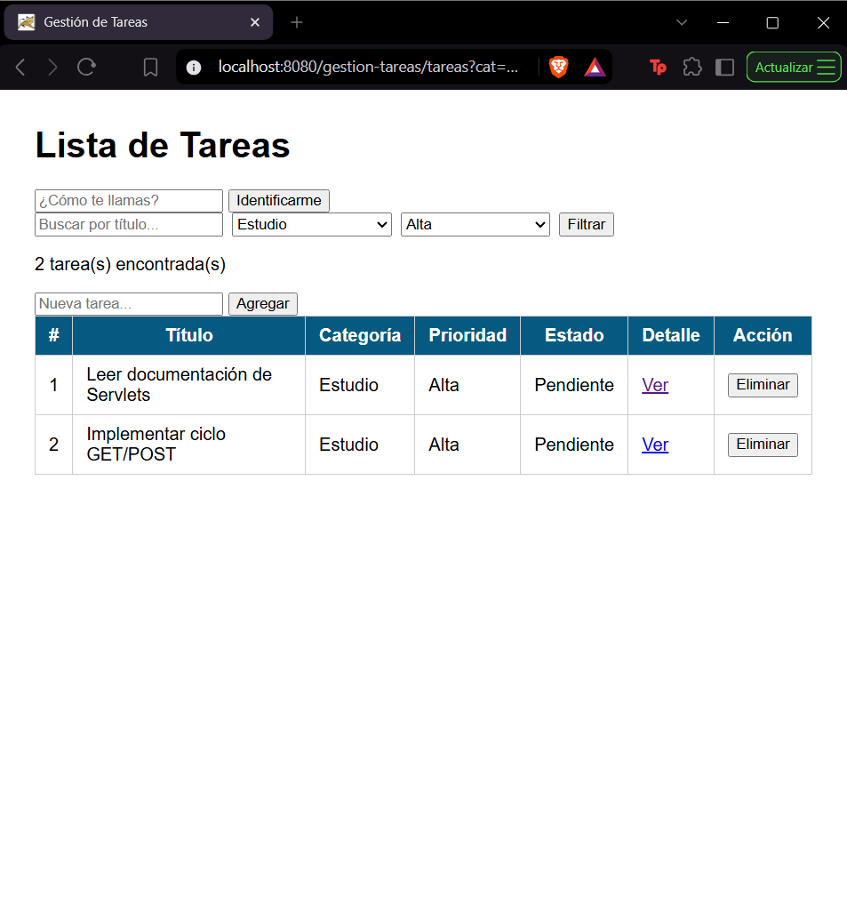
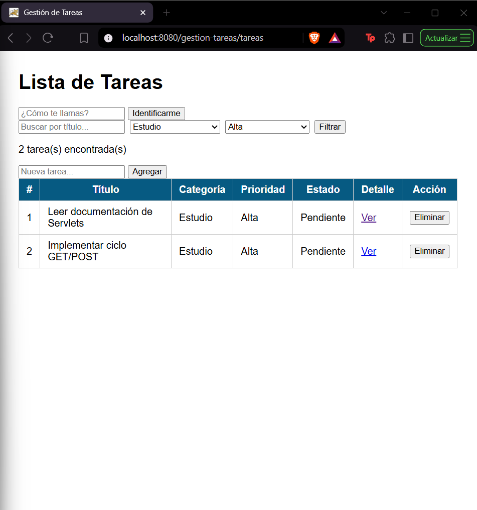
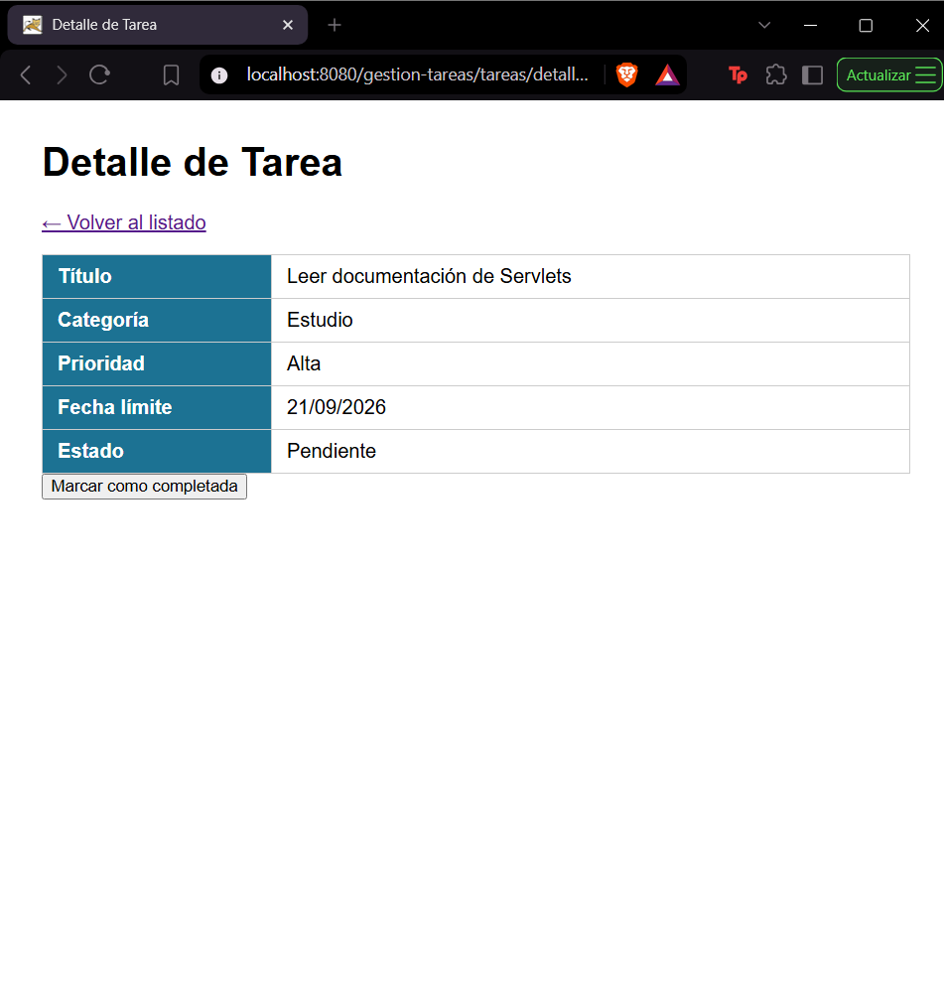
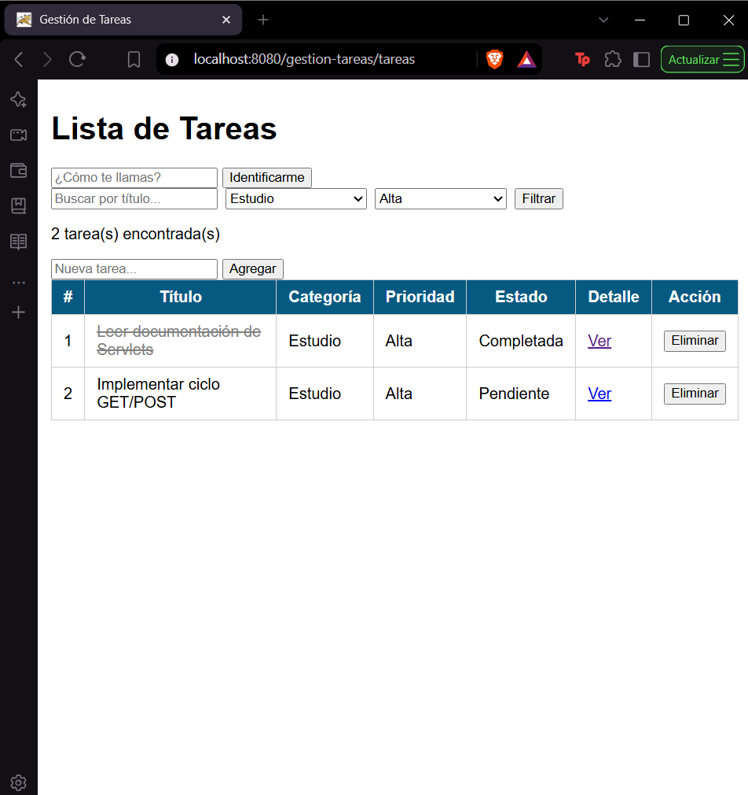
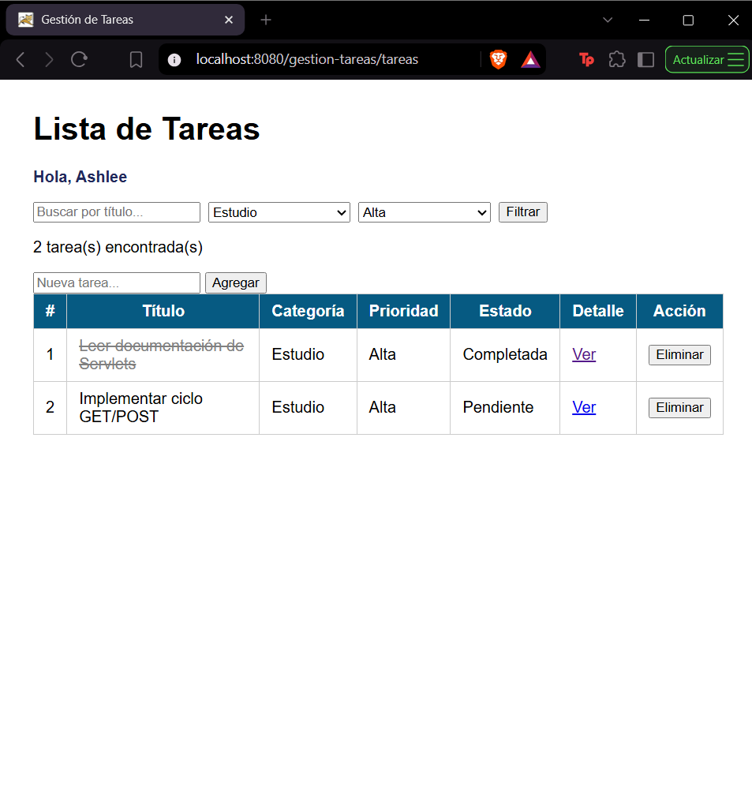

# Post-contenido — Unidad 5: Fundamentos de Java Web (Servlets y JSP)

## Descripción
Repositorio del laboratorio de la Unidad 5 de Programación Web —
Séptimo Semestre. Un único proyecto Maven Web (gestion-tareas) con dos
partes que extienden el mismo dominio de tareas: la Parte 1 construye
el Servlet base con el ciclo GET/POST y el patrón Post/Redirect/Get; la
Parte 2 le agrega filtrado combinado, vista de detalle con un segundo
Servlet, y sesión para personalización y persistencia del filtro.

## Parte 1 — Servlet de gestión de tareas
TareasServlet procesa peticiones GET (listar) y POST (agregar,
eliminar), con validación en el servidor y el patrón Post/Redirect/Get
para evitar el reenvío de formularios.

## Parte 2 — Filtros, detalle y sesión
TareasServlet se extiende con filtrado combinado por texto, categoría
y prioridad, y con las acciones completar e identificar. Se agrega
DetalleTareaServlet, que lee la misma lista de tareas desde
applicationScope y hace forward a una vista de detalle. HttpSession
guarda el nombre del usuario identificado y el último filtro aplicado.

## Decisiones de diseño
- La lista de tareas es una variable de instancia porque es estado
  compartido de toda la aplicación, no un dato de una petición
  individual (ver comentario en TareasServlet.init()).
- El filtro activo y el nombre del usuario se guardan en HttpSession,
  no en el request, porque deben sobrevivir a varias peticiones
  distintas (navegación entre /tareas y /tareas/detalle).
- DetalleTareaServlet obtiene las tareas desde el ServletContext
  (applicationScope) en vez de duplicar la lista, y usa forward en
  lugar de redirect porque solo necesita entregar un objeto ya
  calculado a una vista, sin generar una nueva petición del navegador.
- Los estilos se extrajeron a css/estilos.css al agregar una segunda
  vista (detalle.jsp), para no duplicar el bloque "style" de la
  Parte 1 en cada JSP.

## Cómo compilar y desplegar
1. Clonar el repositorio: `git clone https://github.com/Ashh2222/Arayon-post1-u5-.git`
2. Abrir la carpeta como proyecto Maven en IntelliJ IDEA
3. Ejecutar `mvn clean package`
4. Copiar el archivo .war generado en target/ a la carpeta webapps/ de
   un Apache Tomcat 10.x y ejecutar startup.bat (Windows) o startup.sh
   (Mac/Linux)
5. Acceder a http://localhost:8080/gestion-tareas/tareas

## Capturas de pantalla

